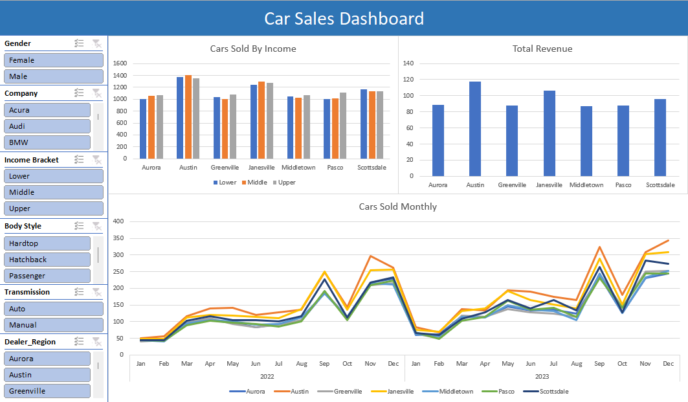

# Car Sales Dashboard

## Project Overview

This project presents an interactive Excel dashboard analyzing car sales performance across multiple dealerships using a public dataset from Kaggle.

The analysis focuses on comparing dealership performance, evaluating sales trends, and enabling dynamic filtering of key metrics to better understand patterns in vehicle sales.

Pivot tables and pivot charts were used to aggregate and visualize the data, while slicers were implemented to allow interactive filtering and improve dashboard usability.

---

## Objectives

The goals of this project were to:

* Analyze car sales performance across multiple dealerships
* Compare sales across vehicle categories
* Identify patterns and trends in sales data
* Develop an interactive dashboard using Excel
* Demonstrate Excel-based data analysis and visualization skills

---

## Tools & Technologies

* **Microsoft Excel**
* **Pivot Tables**
* **Pivot Charts**
* **Slicers**
* **GitHub**

---

## Dataset

**Source:** Kaggle Car Sales Dataset
(https://www.kaggle.com/datasets/missionjee/car-sales-report)

The dataset contains vehicle sales records including dealership information, vehicle attributes, and sales data.

Additional dataset details are available in:

`data/README.md`

---

## Key Visualizations

### Dashboard Overview



This dashboard provides a summary view of sales performance and key metrics.

---

### Interactive Filtering Example


Slicers allow users to dynamically filter the dashboard by dealership and vehicle attributes, updating all visualizations automatically.

---

## Excel Dashboard File

The complete interactive Excel dashboard is available here:

`excel/car_sales_dashboard.xlsx`

To use:

* Open the Excel file
* Navigate to the **Dashboard** sheet
* Use the slicers to interact with the data

---

## Repository Structure

```plaintext
car-sales-dashboard-excel/

├── excel/
├── images/
├── data/
└── README.md
```

---

## Skills Demonstrated

* Excel dashboard development
* Pivot table creation and configuration
* Interactive dashboard design
* Data visualization
* Business data analysis

---

## Author

Ethan Long
Aspiring Data Analyst

[LinkedIn](https://www.linkedin.com/in/ethan-long-652165289/)

---
